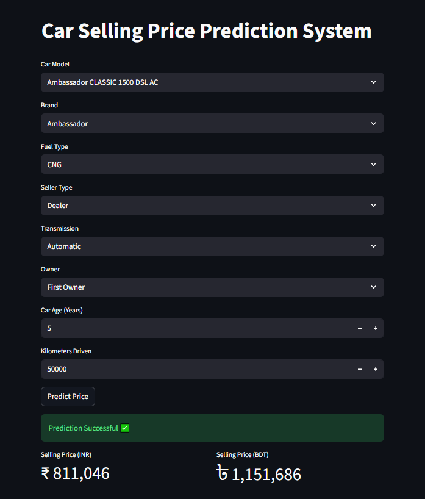

# 🚗 Car Selling Price Prediction System

A Machine Learning web application that predicts the selling price of used cars using **Linear Regression** and **Streamlit**.

---

## 📖 Project Overview

This project was developed as a practice project to demonstrate the complete Machine Learning workflow, from data preprocessing and feature engineering to model training, evaluation, and deployment using Streamlit.

The application predicts the selling price of a used car based on user-provided vehicle information and displays the estimated price in both **Indian Rupees (INR)** and **Bangladeshi Taka (BDT)**.

---

## 📸 Application Preview



---

## ✨ Features

- 🚘 Car Model Selection
- 🏷️ Brand Selection
- ⛽ Fuel Type Selection
- 👤 Seller Type Selection
- ⚙️ Transmission Selection
- 👥 Owner Type Selection
- 📅 Car Age Input
- 🛣️ Kilometers Driven Input
- 💰 Selling Price Prediction
- 🇮🇳 Selling Price in INR
- 🇧🇩 Selling Price in BDT
- 🎨 Clean and User-Friendly Streamlit Interface

---

## 🛠️ Technologies Used

- Python
- Pandas
- NumPy
- Scikit-learn
- Streamlit
- Joblib
- Matplotlib
- Seaborn

---

## 🤖 Machine Learning Workflow

- Data Cleaning
- Exploratory Data Analysis (EDA)
- Feature Engineering
- Data Preprocessing
- Model Training
- Model Evaluation
- Model Deployment

---

## 📊 Model Information

**Machine Learning Algorithm**

- Linear Regression
- Decision Tree Regressor
- Random Forest Regressor
- Gradient Boosting Regressor
- K-Nearest Neighbors Regressor
- XGBoost Regressor

**Evaluation Metrics**

- Mean Absolute Error (MAE)
- Mean Squared Error (MSE)
- Root Mean Squared Error (RMSE)
- R² Score

The model with the highest performance was selected as the final model for deployment.

**Selected Model:** Linear Regression

---

## 📈 Feature Coefficients

Feature coefficients were analyzed to understand how each feature influences the predicted selling price.

The analysis showed that vehicle-related features such as:

- Car Model
- Brand
- Transmission
- Fuel Type
- Car Age
- Kilometers Driven

have varying levels of impact on the predicted selling price.

The coefficient analysis was performed using the trained **Linear Regression** model to improve model interpretability.

## 📂 Dataset

**Dataset:** CarDekho Used Car Dataset

### Input Features

- Car Model
- Brand
- Fuel Type
- Seller Type
- Transmission
- Owner
- Car Age
- Kilometers Driven

### Target Variable

- Selling Price

---

## 📁 Project Structure

```text
Car_Price_Prediction/
│
├── app.py
├── used_car_price_prediction_model.pkl
├── CAR DETAILS FROM CAR DEKHO.csv
├── requirements.txt
├── README.md
├── .gitignore
└── Screenshot_7.png
```

---

## 🚀 Installation

Clone the repository

```bash
git clone https://github.com/your-username/Car-Price-Prediction.git
```

Navigate to the project directory

```bash
cd Car-Price-Prediction
```

Install the required packages

```bash
pip install -r requirements.txt
```

Run the application

```bash
streamlit run app.py
```

---

## 💱 Currency Conversion

The application automatically converts the predicted selling price from **INR** to **BDT** using a configurable exchange rate.

```
Selling Price (BDT) = Selling Price (INR) × Exchange Rate
```

---

## 👨‍💻 Author

**Jayed Islam**

Data Scientist

---

⭐ Thank you for visiting this repository.
